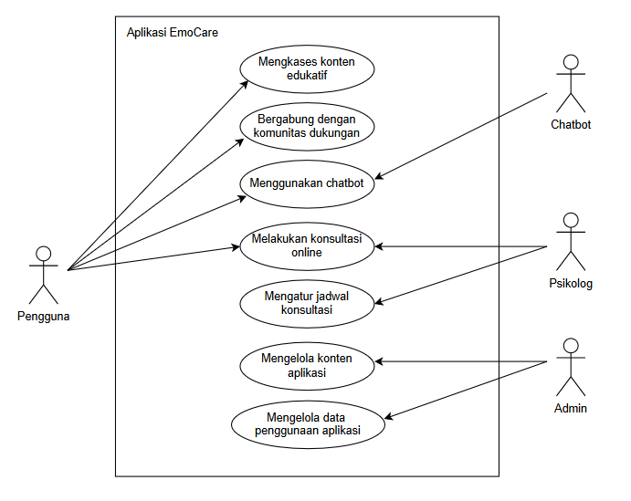
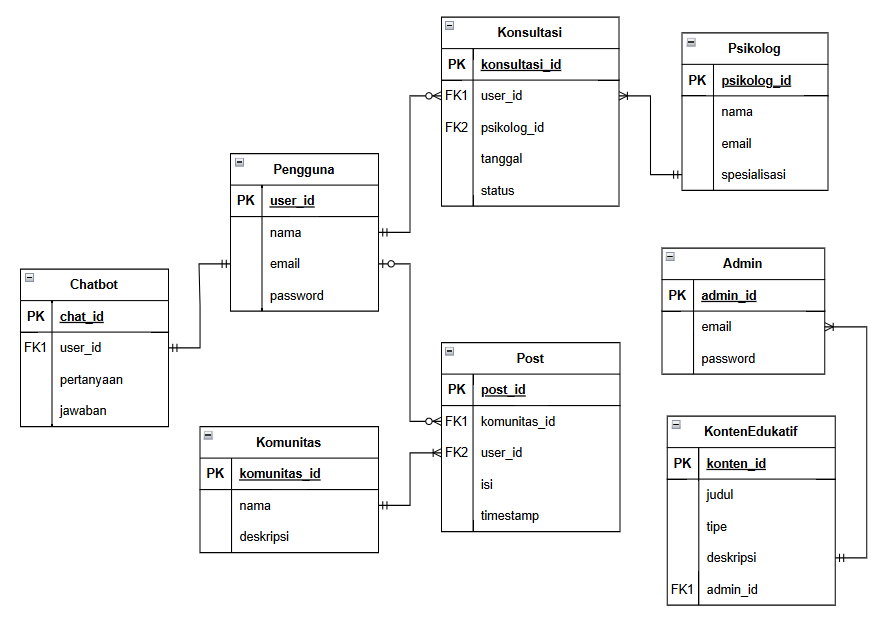
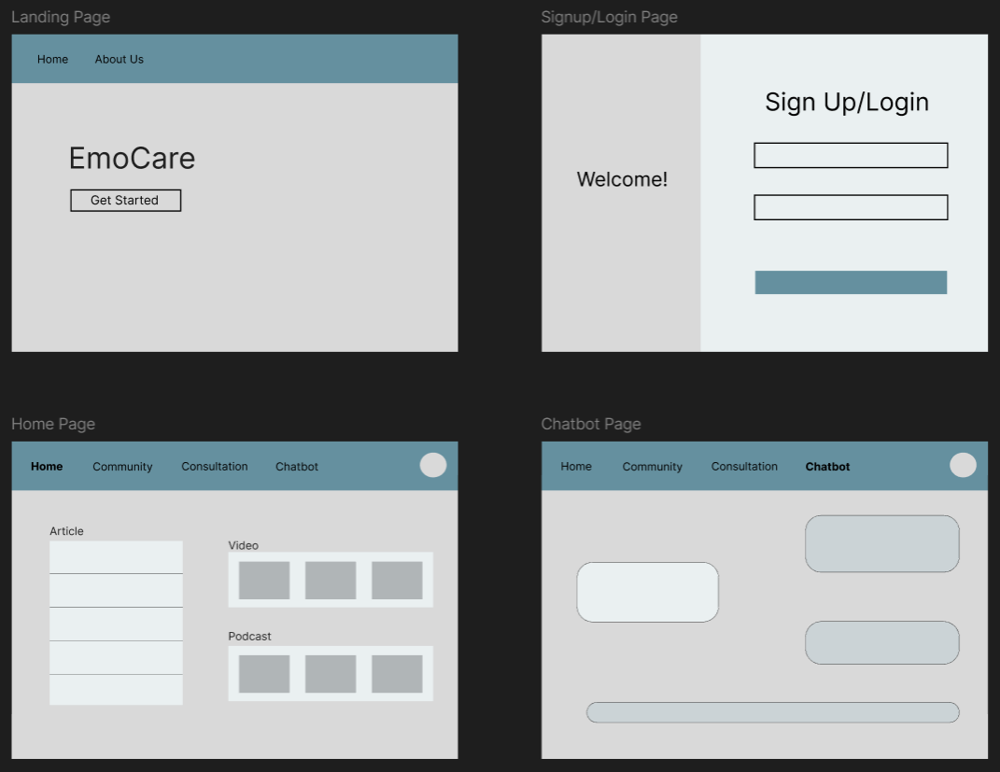
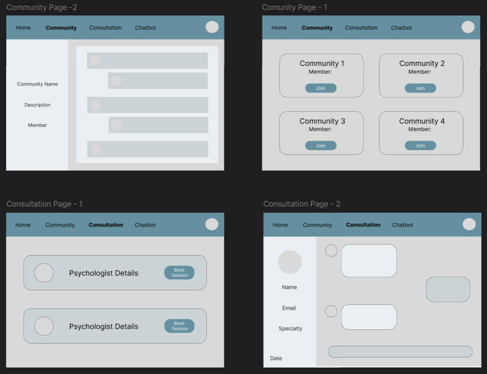
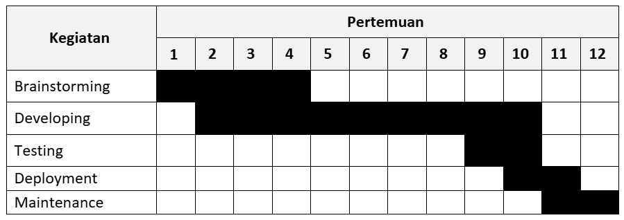

# **apa yaa**
- **Kholil Asjaduddin**: 22/504792/TK/55224
- **Raudha Nur Hidayatullah Susanto**: 22/500044/TK/54789
- **Tsania Galuh Banggash**: 22/500322/TK/54832

**Project Senior Project TI**
**Departemen Teknologi Elektro dan Teknologi Informasi, Fakultas Teknik, Universitas Gadjah Mada**

---

### **Nama Produk**
EmoCare

### **Jenis Produk**
Healthcare Technology

### **Latar Belakang**
Kesehatan mental menjadi isu global yang semakin mendapat perhatian, terutama dengan meningkatnya kasus stres, kecemasan, dan depresi. Sekitar 280 juta orang di dunia mengalami depresi. Namun, akses terhadap layanan kesehatan mental masih terbatas karena beberapa faktor, seperti kurangnya tenaga profesional, biaya yang tinggi, serta adanya stigma sosial yang melekat pada konsultasi psikologis dan terhadap pengidap gangguan kesehatan mental. Setidaknya 90% orang dengan gangguan kesehatan mental tidak mendapatkan akses terhadap perawatan yang memadai, menurut prediksi Kementerian Kesehatan Indonesia. Penerapan inovasi teknologi dapat memberikan solusi untuk kemudahan akses layanan kesehatan mental di era digital saat ini. 

Kemajuan teknologi memungkinkan pengembangan aplikasi yang dapat memberikan dukungan awal kepada pengguna secara cepat, mudah, dan personal. Aplikasi yang dikembangkan menyediakan berbagai fitur, seperti konten edukatif, konsultasi online, chatbot berbasis AI, serta ruang komunitas dan dukungan sosial. Chatbot berbasis AI dapat memberikan konseling awal dan saran praktis kepada pengguna secara real-time. Penerapan komputasi awan memungkinkan aplikasi untuk menyimpan dan mengelola data secara aman serta mefasilitasi interaksi dengan profesional. 

Proyek ini bertujuan untuk mengembangkan aplikasi kesehatan mental yang mengimplementasikan jaringan komputer, komputasi awan, dan AI dalam membantu pengguna mengelola dan merawat kesehatan mental dengan akses yang lebih mudah, terjangkau, dan efektif.

### **Permasalahan**
1. Bagaimana cara kerja aplikasi memanfaatkan jaringan komputer, komputasi awan, dan AI untuk membantu pengguna mengelola kesahatan mental? 
2. Seberapa efektif fitur-fitur aplikasi dapat meningkatkan aksesibilitas pengguna terhadap layanan kesehatan mental? 
3. Apa saja manfaat dan tantangan dalam penerapan teknologi untuk meningkatkan kesejahteraan mental pengguna?

## **Solusi**
Sebuah platform inovatif yang dirancang untuk memberikan dukungan kesehatan mental yang mudah diakses dan terjangkau bagi semua orang. Memungkinkan pengguna berinteraksi dengan profesional dan komunitas dari jarak jauh.  Aplikasi ini juga memanfaatkan kecerdasan buatan yang mampu memberikan saran sesuai keluhan terkait kesehatan mental pengguna.

## **Analisis Kompetitor**

| Nama                               | Jenis Kompetitor  | Jenis Produk                                        | Target Customer                                     | Kelebihan                                                                                                                                                 | Kekurangan                                                                                                                                                    | Key Competitive Advantage & Unique Value                                                        |
|:-----------------------------------|:------------------|:----------------------------------------------------|:----------------------------------------------------|:----------------------------------------------------------------------------------------------------------------------------------------------------------|:--------------------------------------------------------------------------------------------------------------------------------------------------------------|:------------------------------------------------------------------------------------------------|
| **Wysa**                           | Direct Competitor | Chatbot AI untuk kesehatan mental & mindfulness     | Orang yang mengalami kecemasan, stres, atau insomnia | - Menggunakan teknik terapi berbasis bukti - Membantu user meditasi & mindfulness - Memiliki fitur pelacak mood harian                              | - Beberapa fitur hanya tersedia di premium - Tidak memiliki banyak variasi topik percakapan - Kurang personal dibanding bicara dengan manusia           | Kombinasi antara chatbot kesehatan mental dan teknik mindfulness yang membuatnya lebih holistik |
| **Woebot: The Mental Health Ally** | Direct Competitor | Chatbot AI untuk kesehatan mental                   | Remaja & dewasa yang butuh dukungan mental ringan   | - Berdasarkan CBT (Cognitive Behavioral Therapy) - Bisa digunakan kapan saja tanpa psikolog - Gratis untuk fitur dasar                              | - Terbatas hanya berbasis teks - Tidak bisa menggantikan terapi profesional - Beberapa fitur hanya tersedia ketika premium                              | Mudah digunakan tanpa biaya besar                                                               |
| **Moodmate**                       | Direct Competitor | Aplikasi AI Health Assistant untuk kesehatan mental | Remaja, dewasa muda, dan pekerja                    | - Memiliki AI Health Assistant untuk mendeteksi gejala awal masalah kesehatan mental - Terintegrasi dengan layanan konsultasi profesional di Indonesia | - Masih dalam tahap pengembangan dan belum terlalu populer - Tidak semua fitur tersedia secara gratis - Kurang fleksibel dibandingkan chatbot yang lain | Solusi kesehatan mental berbasis AI yang terintegrasi dengan tenaga profesional di Indonesia    |

## **SDLC Pengembangan Produk**
Metodologi: Scrum

Scrum memiliki fleksibilitas dan adaptabilitasnya yang tinggi. Dengan sprint yang pendek (satu pekan), Scrum memungkinkan tim untuk beradaptasi dengan perubahan kebutuhan dan prioritas proyek secara terus-menerus. Hal ini memungkinkan pengiriman incremental, di mana bagian dari produk dapat diselesaikan dan dievaluasi secara berkala. Selain itu, Scrum mendorong transparansi dan kolaborasi melalui pertemuan harian (daily stand-ups), perencanaan sprint, dan retrospektif, sehingga memastikan semua anggota tim tetap sinkron dan fokus pada tujuan yang sama. Melalui evaluasi berkelanjutan ini, tim dapat terus meningkatkan proses dan kinerjanya. 

### **Tujuan Produk**
1. Memastikan layanan kesehatan mental lebih mudah diakses oleh semua orang, tanpa memandang lokasi dan biaya. 
2. Menggunakan chatbot berbasis AI untuk memberikan saran dan konseling awal secara real-time kepada pengguna. 
3. Mengimplementasikan jaringan komputer, komputasi awan, dan AI dalam pengembangan aplikasi untuk meningkatkan efisiensi dan efektivitas layanan. 
4. Memungkinkan interaksi jarak jauh dengan profesional kesehatan mental dan komunitas untuk dukungan tambahan. 
5. Menyediakan informasi dan materi edukatif untuk meningkatkan kesadaran dan pengetahuan tentang kesehatan mental. 

### **Pengguna Potensial & Kebutuhan Pengguna**
Pengguna potensial: 
- Remaja dan dewasa muda yang ingin mendapatkan dukungan kesehatan mental 
- Individu dengan keterbatasan akses ke layanan kesehatan mental 
- Orang yang ingin mendapatkan edukasi seputar kesehatan mental 

Kebutuhan pengguna: 
- Akses cepat dan mudah ke dukungan emosional 
- Materi tentang cara mengelola stres, kecemasan, dan masalah kesehatan mental lainnya. 
- Akses ke layanan konsultasi dengan psikolog atau konselor. 
- Mendapatkan saran awal dan dukungan emosional secara real-time. 

### **Use Case Diagram**

### **Functional Requirements**
| Functional Requirements                                 | Deskripsi         |
|:--------------------------------------------------------|:------------------|
| **Mengakses konten edukatif**                           | - Sistem harus menyediakan berbagai jenis konten edukatif terkait kesehatan mental dalam bentuk artikel, video, maupun *podcast*    - Pengguna dapat mencari konten berdasarkan kategori atau *keyword*    - Admin dapat menambah, mengedit, dan menghapus konten edukatif |
| **Bergabung dengan komunitas & dukungan sosial**        | - Pengguna dapat bergabung dalam komunitas berdasarkan minat atau kondisi mental tertentu   - Sistem memungkinkan pengguna untuk memposting cerita atau berbagi pengalaman di komunitas    - Admin dapat mengawasi dan menghapus konten yang melanggar aturan komunitas    - Pengguna dapat berinteraksi dengan sesama anggota komunitas |
| **Menggunakan chatbot**                                 | - Chatbot harus dapat menerima input teks dari pengguna terkait keluhan mental mereka   - Chatbot harus memberikan jawaban berdasarkan analisis AI terhadap input pengguna   - Sistem harus merekomendasikan artikel atau konten edukatif yang relevan berdasarkan interaksi dengan chatbot   - Jika chatbot mendeteksi masalah serius, sistem harus menyarankan pengguna untuk berkonsultasi dengan profesional |
| **Melakukan konsultasi online**                         | - Pengguna harus dapat membuat akun dan *login* untuk melakukan konsultasi *online*   - Sistem harus menyediakan fitur pemesanan jadwal dan pelaksanaan konsultasi dengan psikolog   - Psikolog harus dapat mengelola jadwal konsultasi mereka |
| **Mengatur jadwal konsultasi**                          | - Psikolog harus dapat mengatur ketersediaan jadwal mereka di dalam sistem   - Pengguna dapat memilih sesi yang tersedia untuk konsultasi   - Pengguna dapat membatalkan atau mengubah jadwal sesuai kebijakan yang berlaku |
| **Mengelola konten aplikasi**                           | - Admin harus dapat mengelola konten dan fitur aplikasi agar lebih mudah digunakan oleh pengguna |
| **Mengelola data penggunaan aplikasi**                  | - Sistem harus mengumpulkan dan menyimpan data interaksi pengguna dengan fitur aplikasi   - Admin dapat melihat data penggunaan aplikasi dengan tetap menjaga privasi pengguna |

### **Entity Relationship Diagram**

### **Low-fidelity Wireframe**

### **Gantt-Chart Pengerjaan Proyek**

---